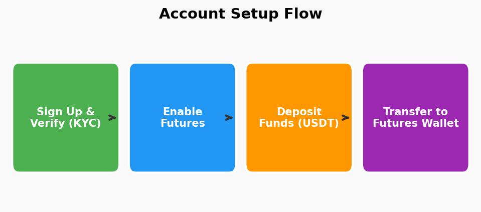
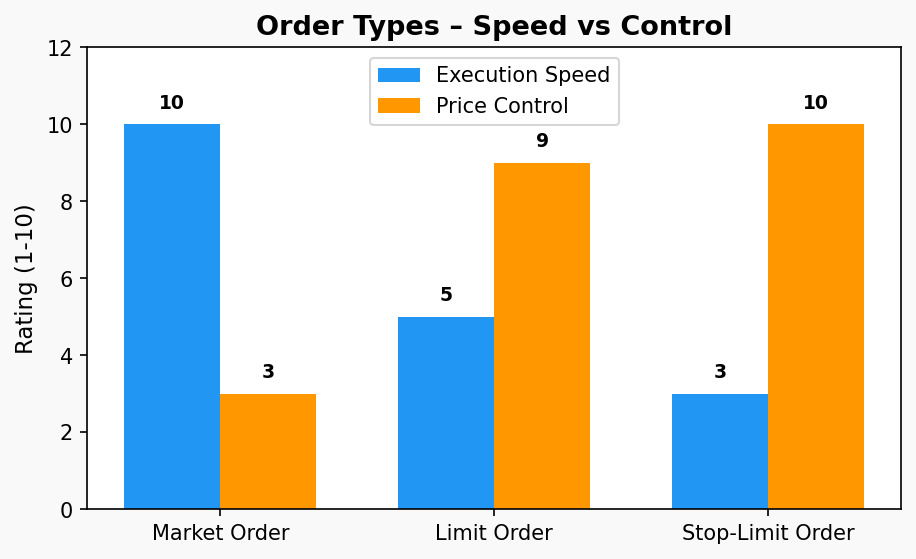
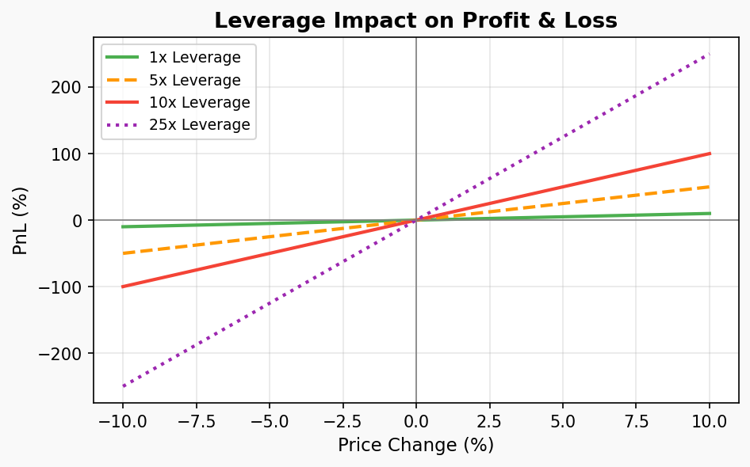
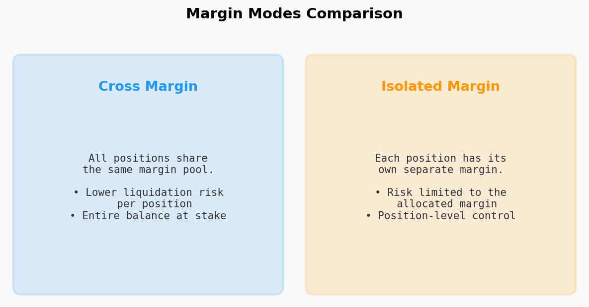
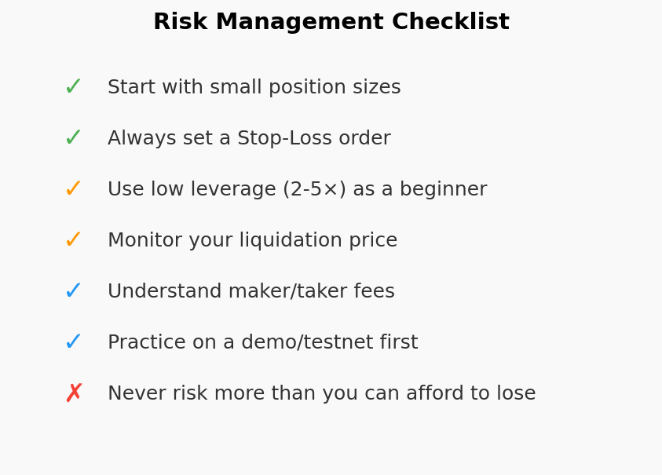

# Binance Futures Trading – Video Summary

This repository contains a **Google-Docs-compatible `.docx` document** that
summarises the YouTube video
**[How to Trade Using Binance Futures](https://www.youtube.com/watch?v=SvXEAj7Mb48)**.

The document includes:

| Section | Image |
|---|---|
| Account Setup Flow |  |
| Order Types Comparison |  |
| Leverage Risk Chart |  |
| Cross vs Isolated Margin |  |
| Risk Management Checklist |  |

## Quick Start

```bash
# Install dependencies
pip install -r requirements.txt

# Generate (or regenerate) the .docx and images
python generate_summary.py
```

The output file **`Binance_Futures_Trading_Summary.docx`** can be opened
directly in Google Docs (upload → *File ▸ Open*) or in Microsoft Word.

## Files

| File | Description |
|---|---|
| `generate_summary.py` | Script that creates the images and assembles the `.docx` |
| `requirements.txt` | Python dependencies |
| `images/` | Generated diagram PNGs embedded in the document |
| `Binance_Futures_Trading_Summary.docx` | The final summary document |

## Disclaimer

This material is for **educational purposes only** and does not constitute
financial advice. Cryptocurrency futures trading involves substantial risk
of loss. Always do your own research.
