# Team Proposal: Emerging Technologies for Nanyang Polytechnic

## IT2392 Emerging Technology Screening

---

**Organization:** Nanyang Polytechnic (NYP)

**Industry Sector:** Education

**Date:** February 2026

**Prepared by:** Team 1

---

### Team Members

| Name | Role | Technology Focus |
|------|------|-----------------|
| Clifton | Team Lead | Artificial Intelligence (AI) |
| Collin | Member | Immersive Media (VR/AR) |
| Declan | Member | Blockchain-Based Certificate Verification |
| Alex | Member | Internet of Things (IoT) – Smart Campus |

---

## Table of Contents

1. [Executive Summary](#1-executive-summary)
2. [Introduction](#2-introduction)
3. [Organization Overview](#3-organization-overview)
4. [Current Problems and Challenges](#4-current-problems-and-challenges)
5. [Market Size and Potential Revenue](#5-market-size-and-potential-revenue)
6. [Value Chain Analysis](#6-value-chain-analysis)
7. [Emerging Technology 1 – Artificial Intelligence (Clifton)](#7-emerging-technology-1--artificial-intelligence-ai)
8. [Emerging Technology 2 – Immersive Media VR/AR (Collin)](#8-emerging-technology-2--immersive-media-vrar)
9. [Emerging Technology 3 – Blockchain-Based Certificate Verification (Declan)](#9-emerging-technology-3--blockchain-based-certificate-verification)
10. [Emerging Technology 4 – Internet of Things / Smart Campus (Alex)](#10-emerging-technology-4--internet-of-things--smart-campus)
11. [Conclusion](#11-conclusion)
12. [References](#12-references)

---

## List of Illustrations

### Figures

| Figure No. | Title | Section |
|---|---|---|
| Figure 1 | NYP Value Chain Model for Education | 6 |
| Figure 2 | Emerging Technologies Mapped to NYP's Value Chain | 6 |
| Figure 3 | AI-Powered Adaptive Learning Workflow | 7 |
| Figure 4 | AI Adoption ROI Projection (3-Year) | 7 |
| Figure 5 | VR/AR Integration Across NYP Schools | 8 |
| Figure 6 | Blockchain Certificate Verification Process Flow | 9 |
| Figure 7 | Blockchain Credential Ecosystem | 9 |
| Figure 8 | IoT Smart Campus Architecture | 10 |
| Figure 9 | Phased Implementation Roadmap | 11 |
| Figure 10 | Total Cost of Ownership – All Technologies (3-Year) | 11 |

### Tables

| Table No. | Title | Section |
|---|---|---|
| Table 1 | Team Members and Technology Assignments | Title Page |
| Table 2 | Digital Education Technology Market Segments | 5 |
| Table 3 | NYP Value Chain – Primary and Support Activities | 6 |
| Table 4 | Technology-to-Value-Chain Mapping | 6 |
| Table 5 | Current Challenges Addressed by AI | 7 |
| Table 6 | AI Benefits to NYP | 7 |
| Table 7 | AI Cost Analysis | 7 |
| Table 8 | Current Challenges Addressed by VR/AR | 8 |
| Table 9 | VR/AR Benefits to NYP | 8 |
| Table 10 | VR/AR Cost Analysis | 8 |
| Table 11 | Current Challenges Addressed by Blockchain | 9 |
| Table 12 | Blockchain Benefits to NYP | 9 |
| Table 13 | Blockchain Cost Analysis | 9 |
| Table 14 | Current Challenges Addressed by IoT | 10 |
| Table 15 | IoT Benefits to NYP | 10 |
| Table 16 | IoT Cost Analysis | 10 |
| Table 17 | Consolidated Technology Investment Summary | 11 |

---

## 1. Executive Summary

This proposal presents a comprehensive technology adoption strategy for **Nanyang Polytechnic (NYP)**, one of Singapore's five government-funded polytechnics serving approximately 15,000 full-time students. Our team has evaluated four emerging technologies identified in the Infocomm Media Development Authority (IMDA) Services and Digital Economy Technology Roadmap and assessed their potential to transform NYP's educational delivery, administrative efficiency, and competitive positioning.

**Key Findings:**

NYP faces significant challenges including curriculum relevance gaps, diverse student learning needs, manual administrative processes, credential fraud risks, limited experiential learning capacity, and rising campus operational costs. These challenges directly affect NYP's ability to fulfil its mission of nurturing industry-ready graduates in an increasingly digital economy.

**Proposed Technologies and Expected Impact:**

- **Artificial Intelligence (AI):** AI-powered adaptive learning, predictive analytics, and intelligent chatbots can improve student pass rates by 15–30%, reduce administrative workloads by 25–40%, and enhance student retention by 10–20%. Year 1 investment: S$550K–1.1M.

- **Immersive Media (VR/AR):** Virtual laboratories and AR-enhanced classrooms can improve knowledge retention by up to 75%, reduce physical lab costs by 20–30%, and increase international student interest by 15–25%. Year 1 investment: S$330K–680K.

- **Blockchain-Based Certificate Verification:** Blockchain-verified digital credentials can reduce manual verification requests by 80%, save S$50,000–100,000 annually on printing, and provide fraud-proof credential authentication. Year 1 investment: S$220K–445K.

- **Internet of Things (IoT) / Smart Campus:** IoT-enabled campus systems can reduce energy costs by 30–40%, improve space utilisation by 20–30%, and enable predictive maintenance with 15–25% cost reduction. Year 1 investment: S$375K–750K.

**Total Investment:** S$1.48M–2.98M in Year 1, with annual recurring costs of S$655K–1.31M. All four technologies are projected to achieve return on investment within 1–3 years through cost savings, improved retention revenue, and operational efficiency gains.

**Strategic Alignment:** These technology adoptions align with IMDA's Digital Enterprise Blueprint, Singapore's Smart Nation Initiative, the SkillsFuture Movement, and the Green Plan 2030, positioning NYP as a leader in technology-enabled education.

---

## 2. Introduction

In today's rapidly evolving digital economy, emerging technologies hold the potential to revolutionise business operations across all sectors, creating new opportunities for growth and innovation. Singapore's education sector, in particular, stands at a critical juncture where digital transformation can significantly enhance teaching, learning, and institutional operations.

The Infocomm Media Development Authority (IMDA) of Singapore has identified nine key technology trends in its Services and Digital Economy Technology Roadmap, including Artificial Intelligence (AI), Immersive Media (AR/VR), Blockchain, and Internet of Things (IoT). These technologies are expected to reshape Singapore's economy over the next three to five years.

This proposal examines how four emerging technologies—Artificial Intelligence, Immersive Media (VR/AR), Blockchain-Based Certificate Verification, and Internet of Things (IoT)—can be adopted by **Nanyang Polytechnic (NYP)** to enhance its educational delivery, administrative efficiency, and overall competitiveness in Singapore's education landscape.

Our team has conducted extensive market research into NYP's current challenges and evaluated how these frontier technologies, as identified in the IMDA technology roadmap, can improve business processes across the institution's value chain. Each team member focuses on a specific technology, analysing its potential impact, benefits, cost implications, and disruption to the digital economy. The proposal applies Porter's Value Chain framework to map each technology to specific primary and support activities at NYP, ensuring that every recommendation is grounded in clear business justification.

---

## 3. Organization Overview

### 3.1 About Nanyang Polytechnic

Nanyang Polytechnic (NYP) is one of Singapore's five government-funded polytechnics, established in 1992. Located in Ang Mo Kio, NYP offers a wide range of full-time and part-time diploma courses across multiple schools:

- School of Business Management
- School of Design & Media
- School of Engineering
- School of Health & Social Sciences
- School of Information Technology
- School of Applied Science

NYP serves approximately 15,000 full-time students annually and offers continuing education and training (CET) programmes for working adults. The institution is known for its applied learning approach and strong industry partnerships with companies like Microsoft, ServiceNow, and other technology leaders.

### 3.2 Mission and Vision

NYP's mission is to nurture industry-ready and future-ready graduates through innovative teaching and applied research. The institution's "Go Beyond" initiative allows learners to customise their diploma journey via Professional, International, or University pathways, integrating industry certifications and real-world experience into the academic framework.

### 3.3 Recent Initiatives

- **AI Nexus Lab:** Launched to help SMEs adopt AI while providing students with hands-on experience in building AI solutions.
- **Microsoft Partnership:** Collaboration to empower student success through Microsoft Power BI and cloud technologies.
- **ServiceNow Protected Platform:** Students build AI solutions on enterprise-grade platforms to gain real-world skills.
- **Common Business & Technology Programme:** Singapore's first common programme integrating business, IT, and engineering disciplines.

---

## 4. Current Problems and Challenges

Nanyang Polytechnic, like many educational institutions, faces several key challenges in the current digital economy:

### 4.1 Keeping Curriculum Relevant

Rapid advancements in AI, cloud computing, and digital tools mean curricula require constant renewal. The pace of technological change often outstrips the speed at which course content can be updated, creating a gap between what students learn and what industry demands.

### 4.2 Diverse Student Learning Needs

NYP's student population is increasingly diverse, with different learning preferences, paces, and career aspirations. Traditional one-size-fits-all teaching methods are insufficient to engage all learners effectively. The challenge is to create flexible, student-centric pathways that accommodate individual needs.

### 4.3 Manual Administrative Processes

Many administrative functions—such as certificate issuance, verification, attendance tracking, and facility management—still rely on manual or semi-automated processes. These are time-consuming, error-prone, and costly to maintain.

### 4.4 Certificate Fraud and Verification Delays

The manual process of verifying academic credentials is slow and susceptible to fraud. Employers and other institutions must contact NYP directly to verify certificates, leading to delays and potential for forged documents.

### 4.5 Limited Experiential Learning Opportunities

While NYP emphasizes applied learning, certain disciplines—such as healthcare, engineering, and sciences—require expensive equipment, labs, or real-world scenarios that are difficult to replicate safely in a classroom setting.

### 4.6 Campus Energy and Resource Efficiency

Managing a large campus with thousands of students requires significant energy and resources. Without smart monitoring systems, energy wastage and inefficient space utilisation add to operational costs.

### 4.7 Data Security and Compliance

Singapore's regulatory environment around data protection (PDPA) and AI governance is stringent. Balancing innovation with security, privacy, and regulatory compliance remains an ongoing challenge.

---

## 5. Market Size and Potential Revenue

### 5.1 Singapore Education Market

The Singapore education market was estimated at approximately **USD 3.62 billion in 2024**, with a projected compound annual growth rate (CAGR) of **7.04%**, expected to reach **USD 7.65 billion by 2035** (Decision Advisors, 2024).

The government's total operating expenditure on education exceeds **S$10 billion annually**, with polytechnic education receiving a significant share. Singapore's five polytechnics collectively serve over 70,000 full-time students.

### 5.2 Digital Education Technology Market

The global EdTech market is valued at over **USD 340 billion in 2024** and is expected to grow at a CAGR of 16.5% through 2030 (Grand View Research). Key growth areas include:

*Table 2: Digital Education Technology Market Segments*

| Technology Segment | Global Market Size (2024) | Projected CAGR |
|---|---|---|
| AI in Education | USD 4.0 billion | 36.0% |
| VR/AR in Education | USD 6.3 billion | 18.2% |
| Blockchain in Education | USD 1.2 billion | 43.9% |
| IoT in Education | USD 15.8 billion | 17.5% |

### 5.3 NYP's Revenue and Funding

NYP receives government funding of approximately **S$200–250 million annually** for operations, with additional revenue from CET programmes, industry partnerships, and research grants. By adopting emerging technologies, NYP can:

- Attract more students (domestic and international) through innovative programmes
- Increase CET and professional development revenue
- Reduce operational costs through automation and smart systems
- Strengthen industry partnerships and sponsored research income

### 5.4 Singapore's Digital Economy Context

Singapore's digital economy contributed **S$128.1 billion in 2024**, representing **18.6% of GDP**—a S$12 billion increase from the previous year. The tech workforce reached 214,000, with AI, data, and cybersecurity roles growing fastest. This context provides a strong foundation for NYP to align its technology adoption with national digital economy goals.

---

## 6. Value Chain Analysis

To ensure that each proposed technology delivers measurable value, our team has mapped NYP's operations to an adapted Porter's Value Chain framework for education. This analysis identifies the primary and support activities where emerging technologies can create the greatest impact.

### 6.1 NYP's Education Value Chain

*Figure 1: NYP Value Chain Model for Education*


*Table 3: NYP Value Chain – Primary and Support Activities*

| Activity Type | Activity | Description |
|---|---|---|
| **Primary** | Student Recruitment & Admissions | Marketing, outreach, application processing, enrolment |
| **Primary** | Curriculum Design & Development | Programme creation, industry alignment, content updates |
| **Primary** | Teaching & Learning Delivery | Classroom instruction, labs, e-learning, assessments |
| **Primary** | Assessment & Certification | Examinations, grading, credential issuance, verification |
| **Primary** | Graduate Outcomes & Career Placement | Career services, employer partnerships, alumni engagement |
| **Support** | Campus Infrastructure | Facility management, energy, space allocation, safety |
| **Support** | IT Systems & Digital Infrastructure | Networks, LMS, student information systems, cybersecurity |
| **Support** | Human Resource Management | Faculty recruitment, training, professional development |
| **Support** | Finance & Administration | Budgeting, procurement, regulatory compliance |

### 6.2 Technology-to-Value-Chain Mapping

Each of the four proposed technologies targets specific value chain activities, ensuring comprehensive coverage and business justification.

*Figure 2: Emerging Technologies Mapped to NYP's Value Chain*

```mermaid
flowchart TB
    subgraph VC["NYP Value Chain Activities"]
        R["Recruitment &\nAdmissions"]
        CD["Curriculum\nDesign"]
        TL["Teaching &\nLearning"]
        AC["Assessment &\nCertification"]
        GO["Graduate\nOutcomes"]
        CI["Campus\nInfrastructure"]
        IT["IT Systems"]
    end

    AI["🤖 AI"] --> R
    AI --> CD
    AI --> TL
    AI --> AC
    AI --> GO

    VR["🥽 VR/AR"] --> TL
    VR --> R
    VR --> CD

    BC["🔗 Blockchain"] --> AC
    BC --> GO
    BC --> IT

    IOT["📡 IoT"] --> CI
    IOT --> TL
    IOT --> IT
```



*Table 4: Technology-to-Value-Chain Mapping*

| Value Chain Activity | AI | VR/AR | Blockchain | IoT |
|---|---|---|---|---|
| **Student Recruitment & Admissions** | Predictive enrolment analytics, chatbot enquiry handling | Virtual campus tours for overseas recruitment | – | – |
| **Curriculum Design & Development** | AI-driven skills gap analysis, industry trend monitoring | VR/AR as a subject of study in Design & Media | – | – |
| **Teaching & Learning Delivery** | Adaptive learning platforms, personalised content | Virtual labs, AR-enhanced classrooms, simulations | – | Smart classrooms, occupancy-based environment control |
| **Assessment & Certification** | AI-assisted grading, plagiarism detection | VR performance-based assessments | Blockchain-verified digital credentials, micro-credentials | Automated attendance tracking |
| **Graduate Outcomes & Career Placement** | AI career matching, skills-to-job mapping | – | Instant employer credential verification, skills portfolio | – |
| **Campus Infrastructure** | – | – | – | Smart energy management, predictive maintenance, safety |
| **IT Systems & Digital Infrastructure** | AI model hosting, data analytics pipeline | VR content management | Blockchain platform integration | IoT device management, cybersecurity |

This mapping demonstrates that the four technologies complement each other across the entire value chain, with **AI** providing the broadest coverage across primary activities, **VR/AR** enhancing the core teaching function, **Blockchain** securing the output (credentials), and **IoT** optimising the physical infrastructure that underpins all activities.

---

## 7. Emerging Technology 1 – Artificial Intelligence (AI)

*Section by Clifton (Team Lead)*

### 7.1 Technology Overview

Artificial Intelligence (AI) refers to the simulation of human intelligence by computer systems, encompassing machine learning, natural language processing, computer vision, and generative AI. As identified by IMDA in its technology roadmap, AI is one of the most transformative technologies shaping Singapore's digital economy.

In the education sector, AI can be applied across the entire value chain—from student recruitment and enrolment to teaching, assessment, and career placement. The global AI in education market is projected to grow from USD 4.0 billion in 2024 to over USD 30 billion by 2030, at a CAGR of approximately 36%.

### 7.2 Current Challenges Addressed by AI

*Table 5: Current Challenges Addressed by AI*

| Challenge | How AI Addresses It |
|---|---|
| Curriculum relevance | AI-powered analytics identify skills gaps and industry trends to inform curriculum updates |
| Diverse learning needs | Adaptive learning platforms personalise content delivery based on individual student performance |
| Manual assessment workload | AI-assisted grading and feedback systems reduce lecturer workload by up to 40% |
| Student retention | Predictive analytics identify at-risk students early for timely intervention |
| Administrative burden | Chatbots and intelligent automation handle routine queries and processes |

### 7.3 How AI Can Improve NYP's Business Processes

*Figure 3: AI-Powered Adaptive Learning Workflow*


#### 7.3.1 Adaptive Learning Platforms

AI-powered learning management systems (LMS) can analyse each student's learning patterns, strengths, and weaknesses to deliver personalised content and assessments. For example:

- Students struggling with specific topics receive additional practice materials automatically
- Advanced learners are offered more challenging content to maintain engagement
- Learning paths are dynamically adjusted based on real-time performance data

**Example:** Carnegie Learning's AI-based math tutoring system has shown a 30% improvement in student outcomes in institutions that adopted it.

#### 7.3.2 AI-Powered Administrative Chatbots

NYP can deploy conversational AI chatbots to handle student enquiries about course registration, fee payments, exam schedules, and campus facilities. This reduces the workload on administrative staff and provides 24/7 support.

**Estimated Impact:** 60–70% of routine student queries can be resolved by AI chatbots, freeing staff to focus on complex cases.

#### 7.3.3 Predictive Analytics for Student Success

By analysing historical data on student attendance, grades, engagement, and demographics, AI models can predict which students are at risk of dropping out or failing. Lecturers and counsellors can then proactively intervene.

**Example:** Georgia State University in the US uses predictive analytics and has increased graduation rates by 22% since implementation.

#### 7.3.4 AI-Assisted Assessment and Feedback

Generative AI tools can assist lecturers in creating assessments, providing automated feedback on written assignments, and detecting plagiarism more effectively than traditional tools.

#### 7.3.5 Curriculum Analytics

AI systems can analyse job market data, industry reports, and employer feedback to recommend curriculum updates that keep NYP's programmes aligned with evolving industry needs.

### 7.4 Disruption to the Digital Economy

AI is fundamentally reshaping the education sector and the broader digital economy:

- **Personalisation at Scale:** AI enables institutions to offer individualised learning experiences to thousands of students simultaneously, disrupting the traditional classroom model.
- **Workforce Transformation:** As AI automates routine tasks, the demand shifts toward higher-order skills—critical thinking, creativity, and emotional intelligence—requiring educational institutions to rethink their curricula.
- **New Business Models:** AI enables micro-credentialing, competency-based education, and lifelong learning platforms that challenge traditional degree-based models.
- **Industry Integration:** AI bridges education and industry by enabling real-time skills matching, internship recommendations, and career pathway optimisation.

### 7.5 Impacts and Benefits

#### Benefits to NYP

*Table 6: AI Benefits to NYP*

| Benefit | Estimated Impact |
|---|---|
| Improved student outcomes | 15–30% improvement in pass rates |
| Reduced administrative costs | 25–40% reduction in routine task workload |
| Better student retention | 10–20% improvement in retention rates |
| Enhanced reputation | Positioning as a technology-forward institution |
| Data-driven decision making | More accurate and timely institutional insights |

#### Benefits to Students

- Personalised learning experiences tailored to individual needs
- Faster feedback on assessments
- 24/7 access to AI-powered support services
- Better career guidance based on skills analysis and market trends

### 7.6 Cost Analysis

*Table 7: AI Cost Analysis*

| Cost Component | Estimated Cost (SGD) | Frequency |
|---|---|---|
| AI-powered LMS platform license | $200,000 – $400,000 | Annual |
| Chatbot development and deployment | $50,000 – $100,000 | One-time |
| Predictive analytics system | $150,000 – $300,000 | One-time + maintenance |
| Staff training and upskilling | $50,000 – $100,000 | Annual |
| Infrastructure (GPU servers, cloud) | $100,000 – $200,000 | Annual |
| **Total Year 1** | **$550,000 – $1,100,000** | |
| **Annual recurring** | **$350,000 – $700,000** | |

**Return on Investment:** Based on improved retention rates (each retained student represents approximately S$8,000–10,000 in tuition fees), retaining an additional 200 students annually would generate S$1.6–2.0 million in additional revenue, exceeding the annual technology investment.

*Figure 4: AI Adoption ROI Projection (3-Year)*

| Year | Cumulative Investment (S$) | Cumulative Benefits (S$) | Net Position (S$) |
|---|---|---|---|
| Year 1 | 825,000 | 500,000 | −325,000 |
| Year 2 | 1,350,000 | 1,400,000 | +50,000 |
| Year 3 | 1,875,000 | 2,700,000 | +825,000 |

*Note: Mid-range estimates used. Benefits include retained tuition revenue, administrative cost savings, and improved graduate employability outcomes.*

### 7.7 Key Challenges for Adoption

1. **Data Privacy and PDPA Compliance:** AI systems require access to student data, raising privacy concerns that must be addressed through robust data governance.
2. **Bias in AI Models:** AI systems trained on historical data may perpetuate biases in student assessment and support allocation.
3. **Faculty Resistance:** Some lecturers may resist AI-assisted tools, fearing loss of autonomy or job displacement.
4. **Integration Complexity:** Integrating AI systems with existing IT infrastructure (e.g., legacy LMS, student records systems) can be technically challenging.
5. **Ongoing Maintenance:** AI models require continuous training and updating to remain accurate and relevant.

---

## 8. Emerging Technology 2 – Immersive Media (VR/AR)

*Section by Collin*

### 8.1 Technology Overview

Immersive Media encompasses Virtual Reality (VR) and Augmented Reality (AR) technologies that create simulated or enhanced environments for users. VR immerses users in a fully digital environment using headsets, while AR overlays digital information onto the real world through devices like smartphones, tablets, or AR glasses.

IMDA has identified immersive media and advanced interfaces as a key technology trend in its Services and Digital Economy Technology Roadmap. The global VR/AR in education market is valued at approximately USD 6.3 billion in 2024, with a projected CAGR of 18.2%.

### 8.2 Current Challenges Addressed by Immersive Media

*Table 8: Current Challenges Addressed by VR/AR*

| Challenge | How VR/AR Addresses It |
|---|---|
| Limited hands-on experience | VR simulations provide safe, repeatable practice environments |
| High equipment costs for labs | Virtual labs reduce the need for expensive physical equipment |
| Student engagement | Immersive experiences increase motivation and knowledge retention |
| Geographic constraints | VR enables virtual field trips and remote collaboration |
| Safety risks in training | Students can practice high-risk procedures without real-world danger |

### 8.3 How VR/AR Can Improve NYP's Business Processes

#### 8.3.1 Virtual Laboratories and Simulations

NYP's engineering, applied science, and health sciences schools can use VR to create virtual laboratories where students perform experiments and practice procedures without physical equipment.

**Examples:**

- **Engineering:** Students can disassemble and reassemble virtual engines, practice welding techniques, or simulate circuit design in a VR environment.
- **Healthcare:** Nursing and health sciences students can practice patient care procedures, anatomy exploration, and emergency response scenarios in VR simulations.
- **Chemistry/Biology:** Virtual lab experiments eliminate the need for expensive chemicals and equipment while allowing unlimited practice.

**Impact:** Studies show that VR-based training can improve knowledge retention by up to 75% compared to traditional classroom instruction (PwC, 2022).

#### 8.3.2 AR-Enhanced Classroom Learning

Augmented Reality can overlay digital information onto physical textbooks, posters, and classroom equipment. For example:

- Scanning a textbook page with a smartphone reveals 3D models, animations, or additional explanations
- AR markers on lab equipment display step-by-step operating instructions
- Interactive AR anatomy models allow students to explore the human body in 3D

#### 8.3.3 Virtual Campus Tours and Recruitment

NYP can use VR to create immersive virtual campus tours for prospective students, particularly those from overseas. This enhances recruitment efforts by allowing potential students to experience NYP's facilities without physical visits.

#### 8.3.4 Collaborative VR Learning Spaces

Multi-user VR environments enable students to collaborate on projects, conduct virtual meetings, and participate in group simulations regardless of their physical location. This supports NYP's blended learning approach.

#### 8.3.5 Design and Media Programme Enhancement

NYP's School of Design & Media can leverage VR/AR as both a teaching tool and a subject of study, equipping students with skills in immersive content creation—a growing industry demand.

### 8.4 Disruption to the Digital Economy

*Figure 5: VR/AR Integration Across NYP Schools*

```mermaid
flowchart TB
    VR["VR/AR\nTechnology\nPlatform"]
    VR --> ENG["School of\nEngineering\n• Virtual engine labs\n• Welding simulations"]
    VR --> HSS["School of Health\n& Social Sciences\n• Patient care VR\n• Anatomy exploration"]
    VR --> SAS["School of\nApplied Science\n• Virtual chemistry labs\n• Biology simulations"]
    VR --> SDM["School of\nDesign & Media\n• VR content creation\n• AR design tools"]
    VR --> SIT["School of\nInformation Technology\n• VR/AR development\n• UX prototyping"]
    VR --> SBM["School of Business\nManagement\n• Virtual business\n  simulations"]
```



Immersive Media is disrupting the education sector and digital economy in several ways:

- **Democratising Experiential Learning:** VR/AR removes physical and financial barriers to high-quality experiential learning, enabling smaller institutions to offer world-class simulations.
- **Creating New Content Markets:** The demand for educational VR/AR content is creating new business opportunities for content developers and technology providers.
- **Transforming Assessment:** VR enables performance-based assessment in simulated real-world scenarios, providing richer evaluation data than traditional exams.
- **Reshaping Campus Design:** As more learning moves to virtual environments, the physical design and resource allocation of campuses will need to evolve.

### 8.5 Impacts and Benefits

#### Benefits to NYP

*Table 9: VR/AR Benefits to NYP*

| Benefit | Estimated Impact |
|---|---|
| Reduced physical lab costs | 20–30% savings on lab equipment and consumables |
| Improved student outcomes | Up to 75% better knowledge retention |
| Enhanced recruitment | 15–25% increase in international student interest |
| Industry-relevant skills | Graduates with VR/AR competencies are in high demand |
| Scalable content delivery | One VR module serves unlimited students |

#### Benefits to Students

- Safe environment to practice complex or dangerous procedures
- Engaging, interactive learning experiences
- Access to virtual field trips and global experiences
- Development of future-ready digital skills
- Ability to learn at their own pace through self-directed VR modules

### 8.6 Cost Analysis

*Table 10: VR/AR Cost Analysis*

| Cost Component | Estimated Cost (SGD) | Frequency |
|---|---|---|
| VR headsets (e.g., Meta Quest 3, 50 units) | $35,000 – $50,000 | One-time (replace every 3 years) |
| VR/AR software platform licenses | $80,000 – $150,000 | Annual |
| Custom VR content development (per module) | $20,000 – $50,000 | Per module |
| AR application development | $30,000 – $60,000 | One-time |
| VR lab setup (space, networking, storage) | $50,000 – $100,000 | One-time |
| Staff training | $20,000 – $40,000 | Annual |
| Maintenance and support | $15,000 – $30,000 | Annual |
| **Total Year 1 (with 5 VR modules)** | **$330,000 – $680,000** | |
| **Annual recurring** | **$115,000 – $220,000** | |

**Return on Investment:** Reduced expenditure on physical lab equipment and consumables (estimated S$100,000–200,000 annually) combined with increased enrolment from enhanced programme attractiveness can offset the investment within 2–3 years.

### 8.7 Key Challenges for Adoption

1. **High Initial Content Development Costs:** Creating high-quality, discipline-specific VR content requires significant investment in development resources and expertise.
2. **Hardware Lifecycle:** VR headsets and equipment have a limited lifespan and require regular replacement, adding to long-term costs.
3. **Motion Sickness and User Comfort:** Some students may experience discomfort during prolonged VR sessions, requiring careful session design and duration limits.
4. **Faculty Training:** Lecturers need training to effectively integrate VR/AR into their teaching practices, which requires time and institutional support.
5. **Content Localization:** VR/AR content must be adapted to NYP's specific curriculum, which may limit the availability of off-the-shelf solutions.

---

## 9. Emerging Technology 3 – Blockchain-Based Certificate Verification

*Section by Declan*

### 9.1 Technology Overview

Blockchain is a distributed ledger technology that provides a secure, transparent, and immutable record of transactions. In the context of education, blockchain can be used to issue, store, and verify academic credentials—such as diplomas, transcripts, and competition certificates—in a tamper-proof digital format.

IMDA has identified blockchain and distributed ledger technology as one of the nine key technology trends in its Services and Digital Economy Technology Roadmap. The global blockchain in education market is projected to grow from USD 1.2 billion in 2024 to over USD 10 billion by 2030, at a CAGR of approximately 43.9%.

### 9.2 Current Challenges Addressed by Blockchain

*Table 11: Current Challenges Addressed by Blockchain*

| Challenge | How Blockchain Addresses It |
|---|---|
| Certificate fraud | Immutable records prevent forgery and tampering |
| Slow verification process | Instant verification via blockchain lookup |
| High verification costs | Automated verification eliminates manual processing |
| Limited portability | Digital credentials can be shared globally |
| Paper-based records | Digital-first approach reduces paper dependency |

### 9.3 How Blockchain Can Improve NYP's Business Processes

#### 9.3.1 Digital Diploma and Certificate Issuance

NYP can issue all academic credentials—including diplomas, transcripts, competition certificates, and skills badges—as blockchain-verified digital certificates. Each credential is:

- Cryptographically signed by NYP
- Stored on a decentralized blockchain network
- Assigned a unique hash that can be verified by anyone
- Owned and controlled by the student

**Example:** MIT has been issuing blockchain-based digital diplomas since 2017 using the Blockcerts open standard, allowing graduates to share verifiable credentials with employers instantly.

#### 9.3.2 Instant Employer Verification

Employers can verify the authenticity of an NYP graduate's credentials by scanning a QR code or entering a credential ID on a verification portal. This eliminates the need to contact NYP directly and reduces verification time from days or weeks to seconds.

*Figure 6: Blockchain Certificate Verification Process Flow*


#### 9.3.3 Micro-Credentials and Skills Badges

Beyond traditional diplomas, blockchain enables NYP to issue verifiable micro-credentials for:

- Individual module completions
- SkillsFuture courses
- CET programme achievements
- Competition awards and hackathon results
- Industry certification partnerships

*Figure 7: Blockchain Credential Ecosystem*


This creates a comprehensive, verifiable portfolio of a student's competencies.

#### 9.3.4 Academic Record Management

A blockchain-based system can maintain a complete, tamper-proof record of each student's academic journey, including:

- Course enrolments and completions
- Grades and assessments
- Co-curricular activities
- Industry attachments and internships

#### 9.3.5 Cross-Institutional Credit Transfer

Blockchain can facilitate seamless credit recognition between NYP and partner institutions (local universities, overseas institutions) by providing a trusted, standardized record of completed coursework.

### 9.4 Disruption to the Digital Economy

Blockchain-based credentials are disrupting the education sector and digital economy:

- **Decentralized Trust:** Blockchain eliminates the need for centralized verification authorities, enabling direct peer-to-peer credential validation.
- **Lifelong Learning Records:** As education becomes more fragmented (micro-credentials, online courses, boot camps), blockchain provides a unified, verifiable record of all learning achievements.
- **Skills-Based Economy:** Verifiable, granular credentials support the shift from degree-based to skills-based hiring, transforming labour markets.
- **Global Mobility:** Blockchain credentials are borderless, supporting international student and worker mobility—critical for Singapore as a global education and talent hub.

### 9.5 Impacts and Benefits

#### Benefits to NYP

*Table 12: Blockchain Benefits to NYP*

| Benefit | Estimated Impact |
|---|---|
| Reduced verification workload | 80% reduction in manual verification requests |
| Cost savings on printing | S$50,000–100,000 annually on certificate printing |
| Enhanced institutional credibility | Fraud-proof credentials increase trust |
| Competitive advantage | Differentiation from other polytechnics |
| Alumni engagement | Digital credential platform maintains alumni connections |

#### Benefits to Students

- Instant access to verifiable digital credentials
- Full ownership and control of academic records
- Seamless sharing with employers and institutions worldwide
- Comprehensive portfolio of all achievements (not just diplomas)
- Reduced risk of lost or damaged physical certificates

#### Benefits to Employers

- Instant verification of candidate qualifications
- Reduced time and cost of background checks
- Greater confidence in credential authenticity
- Access to detailed skills and competency data

### 9.6 Cost Analysis

*Table 13: Blockchain Cost Analysis*

| Cost Component | Estimated Cost (SGD) | Frequency |
|---|---|---|
| Blockchain platform license/development | $100,000 – $200,000 | One-time |
| Integration with existing student systems | $50,000 – $100,000 | One-time |
| Blockchain transaction fees | $5,000 – $15,000 | Annual |
| Verification portal development | $30,000 – $60,000 | One-time |
| Staff training | $15,000 – $30,000 | Annual |
| Ongoing maintenance and support | $20,000 – $40,000 | Annual |
| **Total Year 1** | **$220,000 – $445,000** | |
| **Annual recurring** | **$40,000 – $85,000** | |

**Return on Investment:** Savings from reduced paper printing (S$50,000–100,000/year), eliminated manual verification labour (estimated 2–3 FTE staff hours at S$80,000–120,000/year), and enhanced enrolment from institutional reputation improvements can achieve ROI within 1–2 years.

### 9.7 Key Challenges for Adoption

1. **Technology Maturity:** Blockchain platforms for education are still evolving, and standards for educational credentials on blockchain are not yet fully established.
2. **Integration with Legacy Systems:** Connecting blockchain platforms with NYP's existing student information systems requires careful planning and middleware development.
3. **Stakeholder Adoption:** Success depends on employers and other institutions accepting and using blockchain-verified credentials.
4. **Regulatory Compliance:** Blockchain systems must comply with Singapore's PDPA and other data protection regulations, particularly regarding student data.
5. **Energy and Environmental Concerns:** Some blockchain consensus mechanisms consume significant energy, though newer proof-of-stake systems address this concern.

---

## 10. Emerging Technology 4 – Internet of Things (IoT) / Smart Campus

*Section by Alex*

### 10.1 Technology Overview

The Internet of Things (IoT) refers to a network of interconnected physical devices embedded with sensors, software, and connectivity that enables them to collect and exchange data. In an educational setting, IoT enables the creation of a "Smart Campus"—an intelligent campus ecosystem that optimises operations, enhances the learning environment, and improves safety.

IMDA has identified IoT as one of the nine key technology trends in its Services and Digital Economy Technology Roadmap. The global IoT in education market is projected to reach approximately USD 20 billion by 2025, with a CAGR of 17.5%.

### 10.2 Current Challenges Addressed by IoT

*Table 14: Current Challenges Addressed by IoT*

| Challenge | How IoT Addresses It |
|---|---|
| High energy costs | Smart sensors optimise lighting, HVAC, and energy usage |
| Inefficient space utilisation | Occupancy sensors track room usage in real time |
| Manual attendance tracking | Automated attendance via RFID/Bluetooth beacons |
| Campus safety | IoT-based surveillance and alert systems |
| Facility maintenance | Predictive maintenance through sensor monitoring |

### 10.3 How IoT Can Improve NYP's Business Processes

*Figure 8: IoT Smart Campus Architecture*


#### 10.3.1 Smart Energy Management

IoT sensors deployed across NYP's campus can monitor and automatically control:

- **Lighting:** Motion-activated and daylight-responsive lighting in classrooms, corridors, and common areas
- **HVAC (Air conditioning):** Temperature sensors adjust cooling based on room occupancy and time of day
- **Electricity:** Smart meters track consumption by building and floor, identifying wastage patterns

**Estimated Impact:** IoT-enabled energy management systems typically deliver **30–40% reduction in energy costs** for educational campuses.

#### 10.3.2 Smart Classroom and Space Management

Occupancy sensors and booking systems enable:

- Real-time visibility of available classrooms, study spaces, and meeting rooms
- Automated room allocation based on class sizes and equipment needs
- Data-driven campus planning based on actual usage patterns
- Dynamic scheduling to maximise facility utilisation

**Example:** Smart campus implementations at institutions like Singapore Polytechnic have demonstrated significant improvements in space utilisation rates through IoT-based room management.

#### 10.3.3 Automated Attendance and Access Control

IoT-based attendance systems using RFID cards, Bluetooth beacons, or facial recognition can:

- Automatically record student attendance when they enter a classroom
- Track lab and library usage
- Control access to restricted areas (server rooms, specialized labs)
- Provide real-time attendance data to lecturers and administrators

This eliminates manual attendance taking, saves approximately 5–10 minutes per class session, and provides accurate data for student engagement analysis.

#### 10.3.4 Predictive Facility Maintenance

IoT sensors on critical infrastructure (elevators, HVAC systems, water systems, electrical panels) enable:

- Continuous monitoring of equipment health
- Early detection of potential failures before they occur
- Automated maintenance scheduling based on actual wear rather than fixed intervals
- Reduced downtime and repair costs

#### 10.3.5 Campus Safety and Emergency Response

IoT-connected devices enhance campus safety through:

- Smart surveillance cameras with anomaly detection
- Environmental sensors (smoke, gas, water leaks)
- Emergency alert systems that can pinpoint location of incidents
- Automated building evacuation guidance systems

### 10.4 Disruption to the Digital Economy

IoT is disrupting the education sector and digital economy in several ways:

- **Data-Driven Campus Operations:** IoT transforms campus management from reactive to proactive, enabling data-driven decisions at every level.
- **Sustainability Leadership:** Smart campus technologies align with Singapore's Green Plan 2030 and demonstrate institutional commitment to environmental sustainability.
- **New Learning Paradigms:** IoT itself becomes a learning tool—engineering and IT students can study real IoT deployments on their own campus.
- **Connected Ecosystem:** IoT enables seamless integration between physical and digital campus experiences, supporting hybrid learning models.

### 10.5 Impacts and Benefits

#### Benefits to NYP

*Table 15: IoT Benefits to NYP*

| Benefit | Estimated Impact |
|---|---|
| Energy cost reduction | 30–40% savings on utilities |
| Improved space utilisation | 20–30% increase in room utilisation rates |
| Reduced maintenance costs | 15–25% reduction through predictive maintenance |
| Enhanced campus safety | Faster emergency response times |
| Sustainability credentials | Support for Green Plan 2030 commitments |

#### Benefits to Students

- Comfortable, well-maintained learning environments
- Easy access to available study spaces and facilities
- Seamless campus navigation and wayfinding
- Enhanced safety and security
- Exposure to real-world IoT technology applications

### 10.6 Cost Analysis

*Table 16: IoT Cost Analysis*

| Cost Component | Estimated Cost (SGD) | Frequency |
|---|---|---|
| IoT sensors and devices (500 units) | $75,000 – $150,000 | One-time (replace every 5 years) |
| IoT platform and dashboard | $80,000 – $160,000 | Annual |
| Network infrastructure upgrades (Wi-Fi 6) | $100,000 – $200,000 | One-time |
| System integration and setup | $50,000 – $100,000 | One-time |
| Cybersecurity for IoT network | $30,000 – $60,000 | Annual |
| Staff training | $15,000 – $30,000 | Annual |
| Ongoing maintenance | $25,000 – $50,000 | Annual |
| **Total Year 1** | **$375,000 – $750,000** | |
| **Annual recurring** | **$150,000 – $300,000** | |

**Return on Investment:** Energy savings alone (estimated S$300,000–500,000 annually based on typical 30–40% reduction on a large campus) can offset the annual recurring costs. Additional savings from predictive maintenance and improved space utilisation accelerate ROI to within 1–2 years.

### 10.7 Key Challenges for Adoption

1. **High Initial Infrastructure Costs:** Deploying sensors and upgrading network infrastructure across a large campus requires significant upfront investment.
2. **Cybersecurity Risks:** IoT devices expand the attack surface and must be secured against hacking, data breaches, and unauthorized access. This is especially critical given Singapore's stringent data protection requirements.
3. **Device Interoperability:** IoT devices from different vendors may use different protocols and standards, creating integration challenges.
4. **Data Privacy:** Collection of granular location and behavior data raises privacy concerns that must be addressed through transparent policies and PDPA compliance.
5. **Technical Expertise:** Maintaining a large-scale IoT deployment requires specialized IT staff with expertise in IoT protocols, edge computing, and data analytics.

---

## 11. Conclusion

### 11.1 Summary of Technology Recommendations

This proposal has examined four emerging technologies identified in IMDA's Services and Digital Economy Technology Roadmap and their potential application at Nanyang Polytechnic:

*Table 17: Consolidated Technology Investment Summary*

| Technology | Primary Impact Area | Year 1 Investment | Annual Recurring | ROI Timeline |
|---|---|---|---|---|
| AI | Teaching, Learning, Administration | S$550K–1.1M | S$350K–700K | 1–2 years |
| VR/AR | Teaching, Experiential Learning | S$330K–680K | S$115K–220K | 2–3 years |
| Blockchain | Credential Management | S$220K–445K | S$40K–85K | 1–2 years |
| IoT | Campus Operations, Energy | S$375K–750K | S$150K–300K | 1–2 years |
| **Total** | | **S$1.48M–2.98M** | **S$655K–1.31M** | |

### 11.2 Recommended Implementation Roadmap

We recommend a phased approach to technology adoption:

*Figure 9: Phased Implementation Roadmap*

```mermaid
gantt
    title NYP Technology Adoption Roadmap
    dateFormat YYYY-Q
    axisFormat %Y-Q%q

    section AI
    AI Chatbots & Predictive Analytics   :a1, 2026-Q3, 180d
    Adaptive Learning Platforms          :a2, after a1, 180d
    AI Curriculum Analytics              :a3, after a2, 180d

    section VR/AR
    VR Module Development (Healthcare, Engineering) :v1, 2027-Q1, 270d
    Comprehensive VR/AR Integration     :v2, after v1, 270d

    section Blockchain
    Blockchain Certificate Pilot        :b1, 2026-Q3, 180d
    Scale to All Credentials            :b2, after b1, 180d
    Full Credential Ecosystem           :b3, after b2, 180d

    section IoT
    IoT Pilot (One Building)            :i1, 2026-Q3, 180d
    Expand to Additional Buildings      :i2, after i1, 270d
    Full Campus Deployment              :i3, after i2, 180d
```

**Phase 1 (Year 1):** Deploy AI chatbots and predictive analytics; begin blockchain certificate pilot for graduating cohort; install IoT sensors in one building as a pilot.

**Phase 2 (Year 2):** Expand AI to adaptive learning platforms; develop VR modules for healthcare and engineering programmes; scale blockchain to all credentials; expand IoT to additional buildings.

**Phase 3 (Year 3):** Full campus IoT deployment; comprehensive VR/AR integration across all schools; AI-driven curriculum analytics; full blockchain credential ecosystem.

*Figure 10: Total Cost of Ownership – All Technologies (3-Year)*

| Category | Year 1 (S$) | Year 2 (S$) | Year 3 (S$) | 3-Year Total (S$) |
|---|---|---|---|---|
| AI | 825,000 | 525,000 | 525,000 | 1,875,000 |
| VR/AR | 505,000 | 167,500 | 167,500 | 840,000 |
| Blockchain | 332,500 | 62,500 | 62,500 | 457,500 |
| IoT | 562,500 | 225,000 | 225,000 | 1,012,500 |
| **Total** | **2,225,000** | **980,000** | **980,000** | **4,185,000** |
| **Cumulative Benefits** | **1,200,000** | **2,800,000** | **4,600,000** | **4,600,000** |
| **Net Position** | **−1,025,000** | **+795,000** | **+2,595,000** | **+415,000** |

*Note: Mid-range cost estimates used. Benefits include energy savings, retained tuition revenue, reduced administrative costs, and operational efficiencies.*

### 11.3 Alignment with National Goals

These technology adoptions align with:

- **IMDA's Digital Enterprise Blueprint:** Supporting digital transformation and AI adoption in Singapore
- **Smart Nation Initiative:** Contributing to Singapore's vision of a digitally connected nation
- **SkillsFuture Movement:** Equipping students and workers with future-ready digital skills
- **Green Plan 2030:** IoT-enabled energy management supports Singapore's sustainability goals

By embracing these emerging technologies, Nanyang Polytechnic can enhance its educational mission, improve operational efficiency, strengthen its competitive position among Singapore's polytechnics, and better prepare students for success in the digital economy.

---

## 12. References

1. IMDA. (2024). *Services and Digital Economy Technology Roadmap*. Infocomm Media Development Authority. https://www.imda.gov.sg/about-imda/research-and-statistics/sgdigital/services-and-digital-economy-technology-roadmap

2. IMDA. (2025). *Annual Report & Singapore Digital Economy Report 2025*. https://www.imda.gov.sg/resources/press-releases-factsheets-and-speeches/factsheets/2025/ar-sgde-2025

3. IMDA. (2024). *Singapore's Digital Enterprise Blueprint*. https://file.go.gov.sg/deb-report-2024.pdf

4. Nanyang Polytechnic. (2026). *Go Beyond Initiative*. https://www.nyp.edu.sg

5. Straits Times. (2026). *Go Beyond: Nanyang Polytechnic unveils new initiative that allows learners to customise how their diplomas are earned*. https://www.straitstimes.com/paid-press-releases/go-beyond-nanyang-polytechnic-unveils-new-initiative-that-allows-learners-to-customise-how-their-diplomas-are-earned-20260107

6. Microsoft. (2024). *Nanyang Polytechnic and Microsoft Empower Student Success*. https://news.microsoft.com/en-sg/2024/10/10/nanyang-polytechnic-and-microsoft-empower-student-success/

7. ServiceNow. (2025). *Nanyang Polytechnic students to build AI solutions on new ServiceNow Protected Platform*. https://newsroom.servicenow.com/press-releases/details/2025/Nanyang-Polytechnic-students-to-build-AI-solutions-on-new-ServiceNow-Protected-Platform-Singapore/default.aspx

8. The Edge Singapore. (2024). *Nanyang Polytechnic launches AI lab to support SMEs while training students*. https://www.theedgesingapore.com/digitaledge/artificial-intelligence/nanyang-polytechnic-launches-ai-lab-support-smes-while-training

9. NYP. (2025). *Nanyang Polytechnic introduces Singapore's First Common Programme in Business, IT, Engineering*. https://www.nyp.edu.sg/media-centre/media-releases/nanyang-polytechnic-introduces-singapore-first-common-programme-in-business-IT-engineering

10. Decision Advisors. (2024). *Singapore Education Market Size, Share, Growth, Demand, Analysis*. https://www.decisionsadvisors.com/reports/singapore-education-market

11. MOE. (2025). *Education Statistics Digest*. Ministry of Education Singapore. https://www.moe.gov.sg/about-us/publications/education-statistics-digest

12. Statista. (2025). *Education in Singapore – statistics & facts*. https://www.statista.com/topics/5766/education-in-singapore/

13. Channel News Asia. (2025). *Singapore's digital economy grows by S$12 billion, as tech jobs climb*. https://www.channelnewsasia.com/singapore/digital-economy-gdp-tech-jobs-ai-adoption-business-5385976

14. Business Times. (2025). *AI adoption fuels growth of Singapore's digital economy*. https://www.businesstimes.com.sg/companies-markets/ai-adoption-fuels-growth-singapores-digital-economy-growing-18-6-2024-gdp

15. NXT Interactive. (2024). *Immersive Technology for Education in Singapore*. https://www.nxtinteractive.sg/blog/immersive-technology-for-education-in-singapore

16. NextXR SG. (2025). *The Future of Education: VR and AR Market Trends in Singapore for 2025*. https://nextxrsg.com/vr-ar-education-trends-singapore-2025/

17. Atlantis Press. (2024). *Future-Ready Skills: The Role of Immersive Technologies in Modernizing Education*. https://www.atlantis-press.com/article/126010658.pdf

18. Protec Blog. (2025). *Blockchain Credentials: Revolutionizing Skill Verification in Education*. https://www.theprotec.com/blog/2025/blockchain-credentials-revolutionizing-skill-verification-in-education/

19. OnChainCert. (2025). *Digital Credentials in Education: A Strategic Guide for Institutions*. https://onchaincert.org/blog/guide-education-sector-digital-credentials/

20. Cryptonomist. (2025). *Blockchain Impacts Education in 2024: Benefits and Future Trends*. https://en.cryptonomist.ch/2025/01/14/blockchain-impacts-education-benefits-future-trends/

21. Kite Metric. (2025). *Blockchain Credentials: Revolutionizing Verification in 2025*. https://kitemetric.com/blogs/blockchain-credentials-revolutionizing-verification-in-2025

22. eLearning Industry. (2024). *How IoT (Internet of Things) Is Impacting Education Ecosystems*. https://elearningindustry.com/how-iot-internet-of-things-is-impacting-education-ecosystems

23. Hashstudioz. (2025). *IoT in Universities: Building Smart Campuses for Smarter Learning*. https://www.hashstudioz.com/blog/iot-in-universities-building-smart-campuses-for-smarter-learning/

24. SPTel. (2024). *Technology in Education: Digital Classroom Transformation in Singapore*. https://sptel.com/technology-in-education-singapore/

25. BTW Media. (2024). *Singapore Polytechnic: Leading the way in smart education*. https://btw.media/all/it-infrastructure/singapore-polytechnic-leading-the-way-in-smart-education/

26. Gartner. (2025). *Top Strategic Technology Trends*. https://www.gartner.com/en/articles/gartner-top-10-strategic-technology-trends

27. Nexdigm. (2024). *Singapore Education Industry Report*. https://www.nexdigm.com/market-research/insights/blog/singapore-education-industry-report/

28. PwC. (2022). *The Effectiveness of Virtual Reality Soft Skills Training in the Enterprise*. https://www.pwc.com/us/en/tech-effect/emerging-tech/virtual-reality-study.html

---

*End of Team Proposal*
