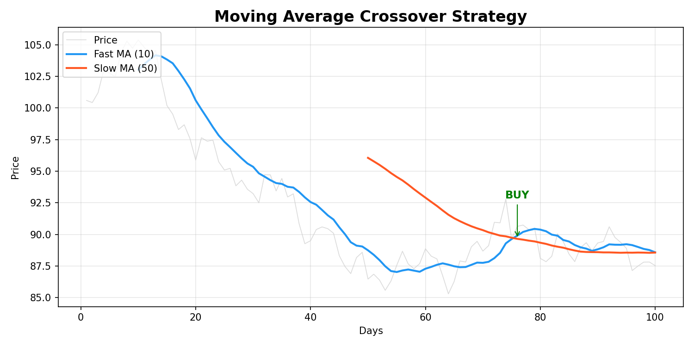
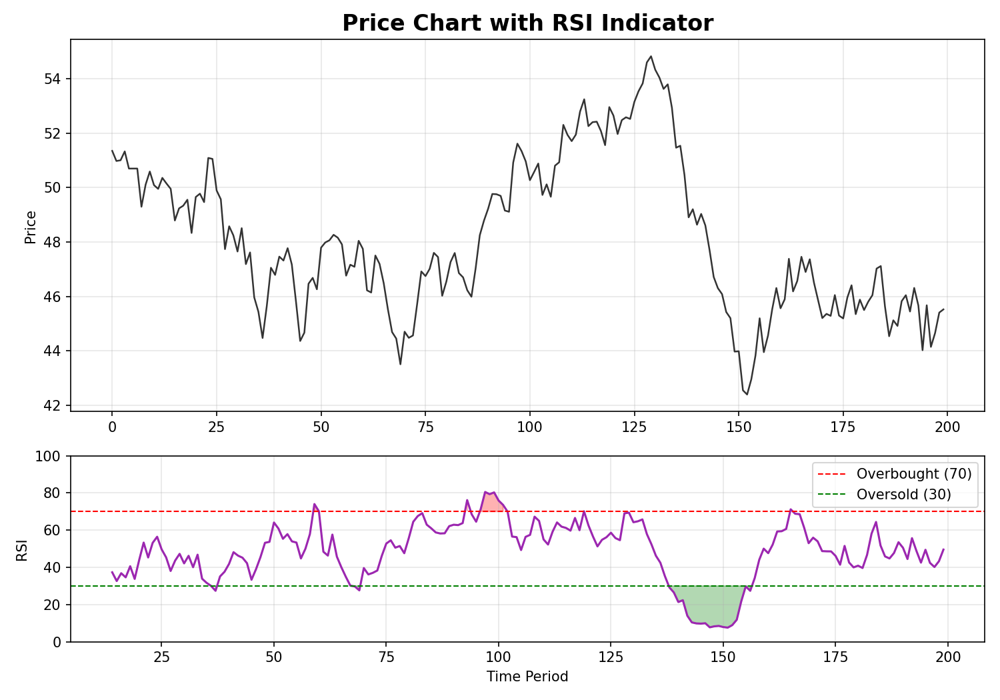
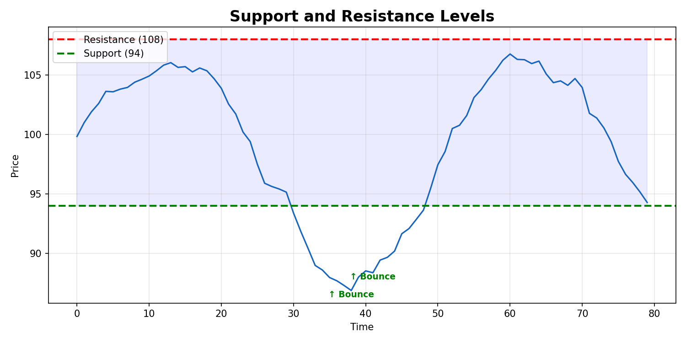
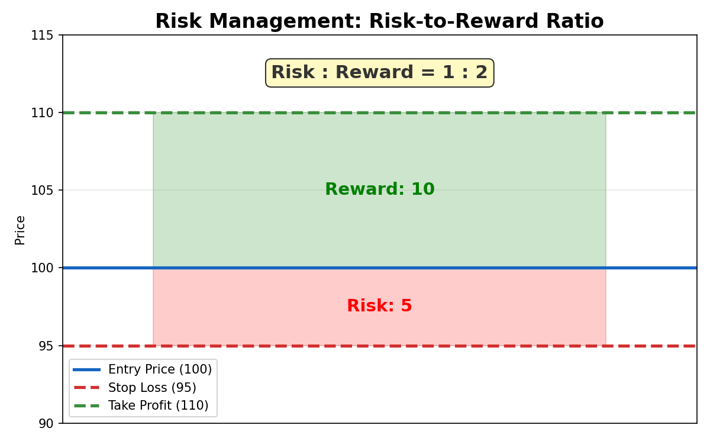
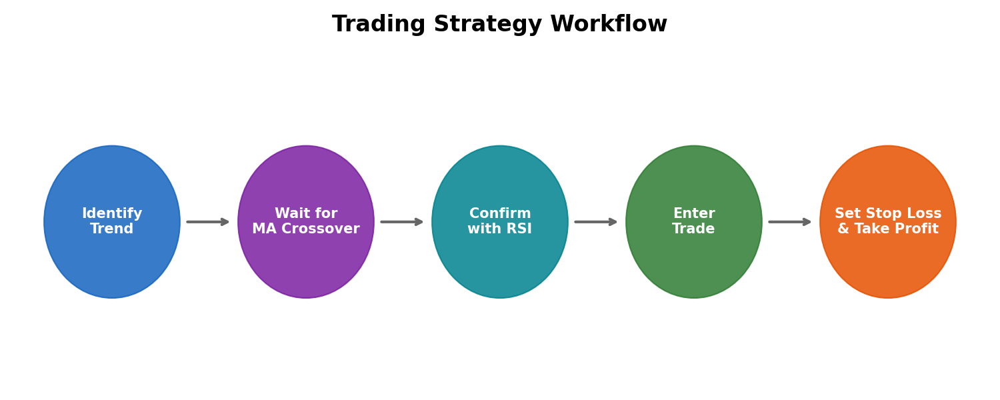

# Super Simple Way to Profit in Financial Markets!

**Video:** [Super Simple Way to Profit in Financial Markets!](https://www.youtube.com/watch?v=HpPj-IYeaho&t=1317s)
**Channel:** Trade Travel Chill

---

## Overview

This video presents a straightforward trading strategy designed for beginners and intermediate traders who want to profit in financial markets (crypto, forex, stocks) without relying on complex analysis. The core philosophy is to keep things simple — use a small number of reliable technical indicators, wait for high-probability setups, and manage risk carefully.

---

## Key Concepts Covered

### 1. Moving Average (MA) Crossover Strategy

The strategy uses two moving averages — a **fast MA** (e.g. 10-period) and a **slow MA** (e.g. 50-period) — to generate trade signals:

- **Buy Signal (Golden Cross):** The fast MA crosses *above* the slow MA, indicating a potential uptrend.
- **Sell Signal (Death Cross):** The fast MA crosses *below* the slow MA, indicating a potential downtrend.

> The chart above shows how a short-term moving average (blue) crossing above the long-term moving average (red) generates a **BUY** signal. Traders enter in the direction of the crossover.

---

### 2. RSI (Relative Strength Index) as a Confirmation Filter

The **RSI** is an oscillator ranging from 0 to 100 that helps filter out false signals from the MA crossover:

- **Overbought (above 70):** The asset may be due for a pullback — avoid entering new long positions.
- **Oversold (below 30):** The asset may be due for a bounce — avoid entering new short positions.
- **Neutral zone (30–70):** Safest area to enter trades following a crossover signal.

> The RSI panel (bottom) highlights overbought zones in red and oversold zones in green. Trades are filtered by only entering when RSI is in the neutral zone, reducing the chance of catching the wrong side of a move.

---

### 3. Support and Resistance Levels

Price tends to bounce off key horizontal levels. The video emphasises waiting for price to reach these zones before entering:

- **Support:** A price level where buying interest is strong enough to prevent further decline.
- **Resistance:** A price level where selling pressure is strong enough to prevent further advance.
- High-probability trades occur when price **bounces off support** (buy) or **gets rejected at resistance** (sell).

> The chart illustrates how price oscillates between support (green) and resistance (red) levels. Traders look for bounces at support and rejections at resistance for trade entries.

---

### 4. Risk Management — The Non-Negotiable Rule

The video stresses that **risk management is more important than the entry strategy itself**:

- **Risk a small percentage** of your account on each trade (typically 1–2%).
- Always set a **stop loss** just beyond the recent swing high/low.
- Target a **risk-to-reward ratio of at least 1:2** — meaning for every $1 risked, aim to make at least $2.
- **Plan your trade and trade your plan** — no emotional decision-making.

> This diagram shows a trade with a 1:2 risk-to-reward ratio. The stop loss (red) is set 5 units below entry, while the take profit (green) is set 10 units above — meaning the potential reward is twice the risk.

---

## The Complete Strategy Workflow

The video outlines a simple 5-step process to execute a trade:

1. **Identify the Trend** — Use price action and moving averages to determine if the market is trending up, down, or sideways.
2. **Wait for a MA Crossover** — A bullish or bearish crossover acts as the primary trade signal.
3. **Confirm with RSI** — Only take the trade if the RSI is not in overbought/oversold territory.
4. **Enter the Trade** — Execute in the direction of the confirmed signal.
5. **Set Stop Loss & Take Profit** — Apply strict risk management with a minimum 1:2 reward-to-risk ratio.

> The workflow above summarises the step-by-step process from trend identification to trade execution with proper risk management.

---

## Key Takeaways

| # | Takeaway |
|---|----------|
| 1 | **Keep it simple** — You don't need dozens of indicators. A moving average crossover + RSI is enough. |
| 2 | **Wait for confirmation** — Don't jump in on every signal. Use RSI to filter bad entries. |
| 3 | **Respect support & resistance** — These levels tell you where the market is most likely to react. |
| 4 | **Risk management is everything** — Never risk more than you can afford to lose. Always use stop losses. |
| 5 | **Discipline over emotion** — Follow the system strictly. Don't let fear or greed drive decisions. |
| 6 | **Patience pays** — Skip unclear or choppy conditions. Only trade high-probability setups. |

---

## Disclaimer

> This summary is for **educational purposes only** and does not constitute financial advice. Trading in financial markets involves significant risk of loss. Always do your own research (DYOR) and consider consulting a qualified financial advisor before making any trading decisions. Never trade with money you cannot afford to lose.

---

*Summary generated from the video [Super Simple Way to Profit in Financial Markets!](https://www.youtube.com/watch?v=HpPj-IYeaho&t=1317s) by Trade Travel Chill.*
