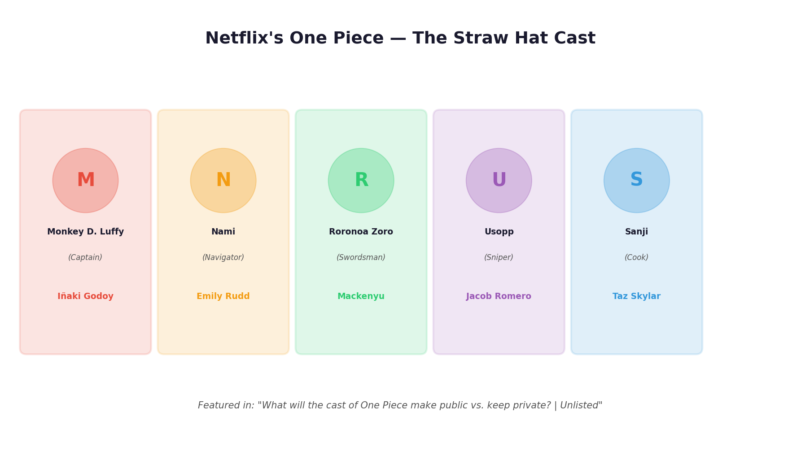
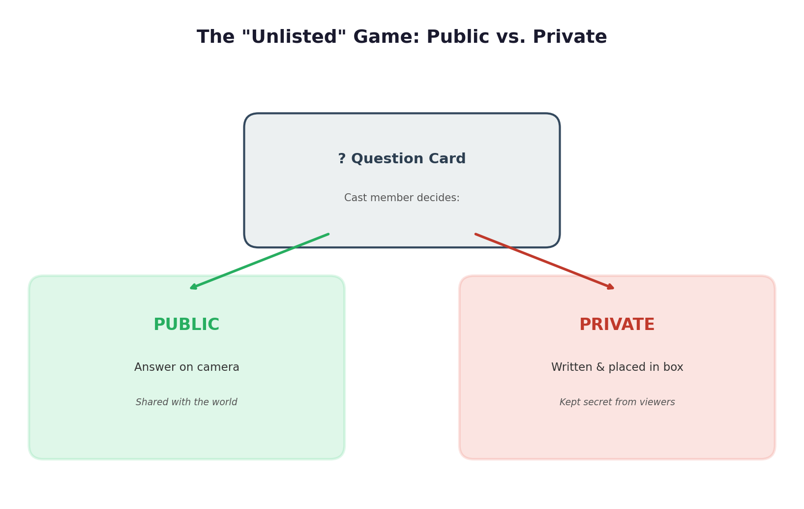
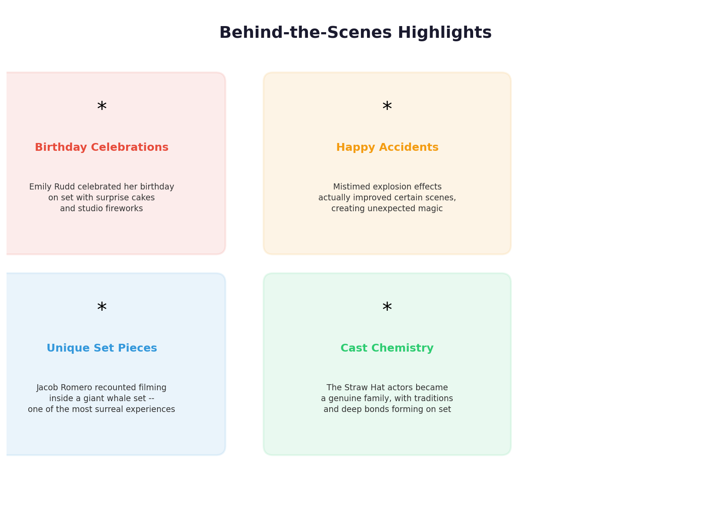
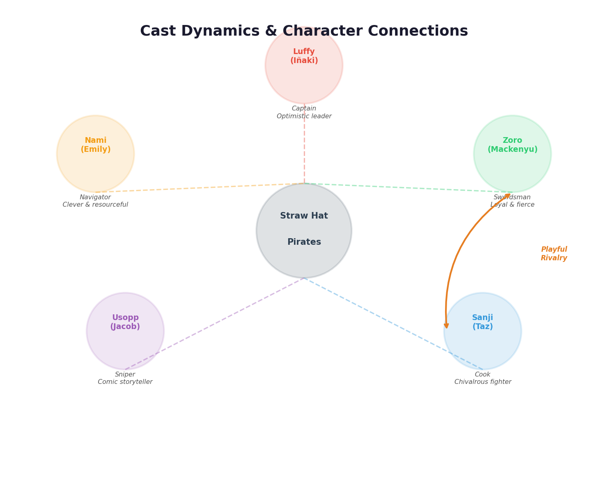
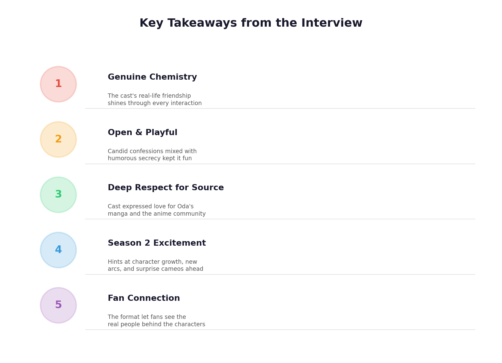

# What Will the Cast of One Piece Make Public vs. Keep Private? | Unlisted

**Video:** [What will the cast of One Piece make public vs. keep private? | Unlisted](https://www.youtube.com/watch?v=SvXEAj7Mb48)
**Channel:** Somehow Studios
**Featuring:** Iñaki Godoy, Emily Rudd, Mackenyu, Jacob Romero, Taz Skylar

---

## Overview

In this episode of *Unlisted*, the five lead actors from Netflix's live-action *One Piece* — Iñaki Godoy (Monkey D. Luffy), Emily Rudd (Nami), Mackenyu (Roronoa Zoro), Jacob Romero (Usopp), and Taz Skylar (Sanji) — sit down for a playful interview game. Each cast member is presented with a series of questions and must choose whether to answer publicly on camera or write their response on a card and place it into a locked "private box," keeping it secret from the audience. The result is a mix of candid confessions, hilarious banter, and heartfelt moments that showcase the genuine chemistry of the Straw Hat crew both on and off screen.

> The five lead actors of Netflix's One Piece and the iconic characters they portray. Together they form the heart of the Straw Hat Pirates.

---

## The "Unlisted" Game Format

The premise of the show is simple but effective:

1. A **question card** is drawn and read aloud to the cast.
2. Each cast member independently decides whether to make their answer **public** (shared on camera for the world to see) or **private** (written down and sealed in a locked box, hidden from viewers).
3. The tension between openness and secrecy drives the entertainment — viewers get to see which topics the actors are comfortable sharing and which ones they guard closely.

> The core mechanic of the Unlisted format: cast members choose to answer each question publicly on camera or keep their response locked away in a private box.

---

## Key Moments and Highlights

### 1. Behind-the-Scenes Stories

The cast shared several memorable stories from the *One Piece* set:

- **Birthday celebrations on set** — Emily Rudd recalled celebrating her birthday during filming, complete with a surprise cake and studio fireworks arranged by the crew. These celebrations became a beloved tradition that highlighted the family-like atmosphere on set.
- **Happy accidents** — Taz Skylar described how mistimed explosion effects during an action sequence accidentally improved the scene, creating what he called "unexpected magic." The cast agreed that some of the best moments happened unplanned.
- **Filming inside a giant whale** — Jacob Romero recounted the surreal experience of performing inside an elaborate whale set piece, calling it one of the most bizarre and wonderful days of shooting.

> A selection of the most memorable behind-the-scenes moments shared by the cast during the interview, from birthday surprises to accidental on-set magic.

---

### 2. Cast Chemistry and Relationships

One of the interview's strongest threads was the evident bond between the five actors:

- The group described themselves as a **genuine family**, not just co-workers. Years of intense filming in South Africa forged deep friendships and shared traditions.
- The **Zoro–Sanji rivalry** (Mackenyu and Taz Skylar) extends playfully off screen. Their bickering hides a deep mutual respect that mirrors their characters' dynamic in the source material.
- **Iñaki Godoy's leadership** parallels Luffy's role as captain — the cast noted that he naturally brings the group's energy together, much like the character he plays.

> The relationships between the five Straw Hat actors mirror the bonds of their characters. Note the playful rivalry between Zoro (Mackenyu) and Sanji (Taz Skylar), a fan-favourite dynamic that carries over from the anime and manga.

---

### 3. Anime Hot Takes and Personal Confessions

The lighter side of the interview included:

- **Favourite One Piece characters** — Cast members revealed which characters from the anime and manga they personally connect with, sometimes choosing characters other than the ones they play.
- **Strange YouTube rabbit holes** — Several cast members confessed to quirky late-night viewing habits, though some of the most embarrassing specifics were quickly placed in the private box.
- **Anime opinions** — A few hot takes about anime in general were shared publicly, drawing laughs and playful disagreements from the group.

---

### 4. Season 2 Teases and Fan Surprises

Without giving away spoilers, the cast hinted at what is ahead:

- **Character growth** — Iñaki Godoy shared that Season 2 gives Luffy more room for both wildness and emotional depth, reflecting his own growth as an actor.
- **New character introductions** — The cast expressed genuine excitement about earlier-than-expected introductions of fan-favourite characters such as Dragon, Sabo, and Brook. Mackenyu admitted to literally screaming when he first learned about these additions.
- **Deeper crew dynamics** — The Straw Hats' bonds are tested more severely in Season 2, with themes of trust, sacrifice, and pursuing dreams under pressure coming to the fore.

---

### 5. What Stayed Private

While many revelations made it into the public, certain topics were firmly locked away:

- Deeply personal or potentially embarrassing stories beyond light-hearted fun.
- Opinions or anecdotes that could reveal too much about other cast members or production secrets.
- Controversial takes that the actors preferred to keep off the record.

The private box served as a respectful boundary, allowing the cast to participate openly while maintaining control over their personal comfort zones.

---

## Key Takeaways

| # | Takeaway |
|---|----------|
| 1 | **Genuine chemistry** — The cast's real-life friendship shines through every interaction, making the interview feel warm and authentic. |
| 2 | **Open yet respectful** — The public/private format struck a perfect balance between candour and personal boundaries. |
| 3 | **Deep respect for the source material** — Every cast member expressed love for Eiichiro Oda's manga and the wider anime community. |
| 4 | **Season 2 excitement** — Hints at character growth, new arcs, and surprise cameos point to an even more ambitious second season. |
| 5 | **Fan connection** — The format let fans see the real people behind the characters, strengthening the bond between audience and cast. |

> A visual summary of the five major takeaways from the cast's Unlisted interview.

---

## Credits

- **Created & Produced by:** Somehow Studios
- **Executive Producer:** Greg T. Gordon
- **Chief Creative Officer:** Joe Sabia
- **Director, Post Production:** Doug Larsen
- **Director:** George Wasgat
- **Producer:** Sam Weiser

---

*Summary generated from the video [What will the cast of One Piece make public vs. keep private? | Unlisted](https://www.youtube.com/watch?v=SvXEAj7Mb48) by Somehow Studios.*
